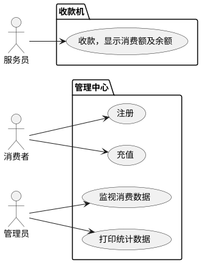
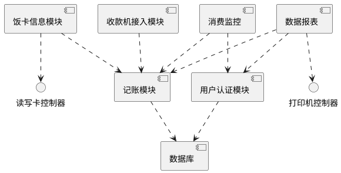
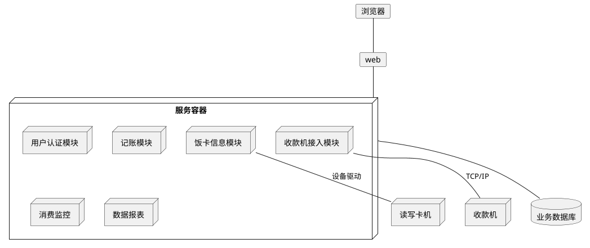

# 食堂就餐卡系统设计

## 场景
* 系统中每个消费者都有一张卡，在管理中心注册缴费，卡内记着消费者的身份、余额。
* 使用时将卡插入收款机则显示卡上金额，服务员按收款机上数字键，收款机自动计算并显示消费额及余额。
* 管理中心的管理员监视每一笔消费，可打印出消费情况的相关统计数据。

## 系统用例图

```plantuml
@startuml

left to right direction

actor 消费者 as ac_cus
actor 服务员 as ac_srv
actor 管理员 as ac_adm

package 管理中心 {
    usecase "注册" as uc_reg
    usecase "充值" as uc_rech
    usecase "监视消费数据" as uc_monit
    usecase "打印统计数据" as uc_print
}

package 收款机 {
    usecase "收款，显示消费额及余额" as uc_check
}

ac_cus --> uc_reg
ac_cus --> uc_rech
ac_srv --> uc_check
ac_adm --> uc_monit
ac_adm --> uc_print

@enduml
```

## 组件图

```plantuml
@startuml

() "读写卡控制器" as nfc
() "打印机控制器" as printer
[用户认证模块] as auth 
[饭卡信息模块] as card 
[收款机接入模块] as cashier
[记账模块] as trade
[数据库] as db
[消费监控] as web
[数据报表] as report

web ..> trade
report ..> printer
report ..> trade
card ..> nfc
card ..> trade
cashier ..> trade
web ..> auth
report ..> auth
auth ..> db
trade ..> db

@enduml
```

## 组件时序图

## 部署图

```plantuml
@startuml

node 收款机
node 读写卡机
node 服务容器 {
    node 用户认证模块
    node 饭卡信息模块
    node 收款机接入模块
    node 记账模块
    node 消费监控
    node 数据报表
}
database db [
    业务数据库
]

card web

card 浏览器

饭卡信息模块 -- 读写卡机 : 设备驱动
收款机接入模块 -- 收款机 : TCP/IP
服务容器 -- db
浏览器 -- web
web -- 服务容器

@enduml
```
