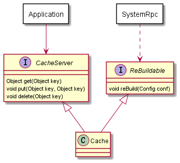
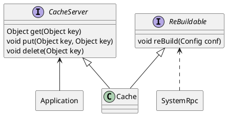

## 请描述什么是依赖倒置原则，为什么有时候依赖倒置原则又被称为好莱坞原则？

传统的依赖模式中高层类依赖低层类，低层模块更容易被重用。而依赖倒置原则正相反，让低层模块依赖高层模块定义的接口，高层不再依赖低层，从而使得高层更容易被复用。

依赖倒置原则让高层摆脱了对低层的依赖，特别是框架设计中：框架定义好接口，应用程序实现接口，框架来调用应用程序。这个过程就像好莱坞电影中黑帮老大的经典台词—— Don't call me, I'll call you，因此得名“好莱坞原则”。

## 请用接口隔离原则优化 Cache 类的设计，画出优化后的类图。

### 原设计

### 改进后的设计

