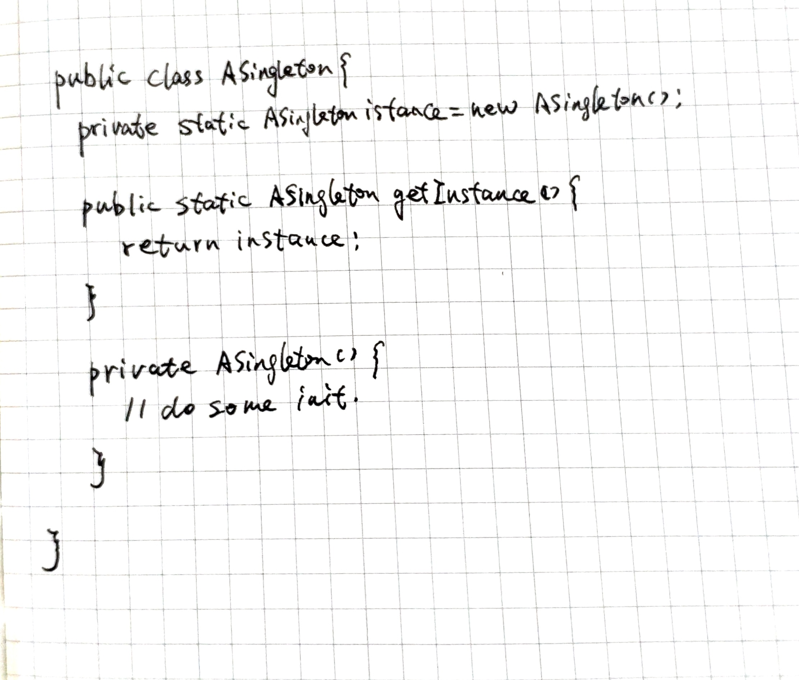
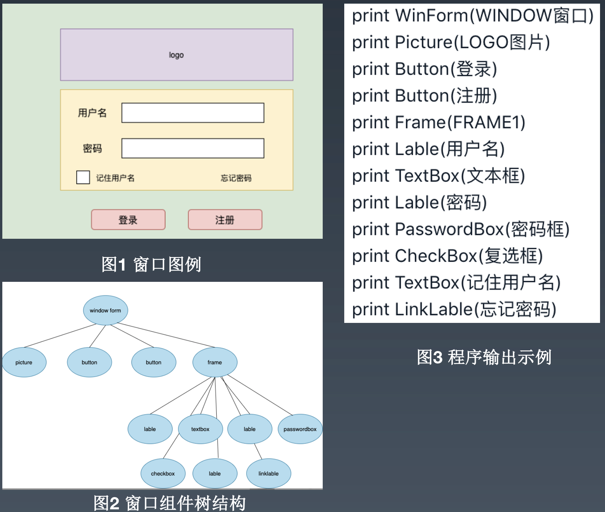

## 1.请在草稿纸上手写一个单例模式的实现代码，拍照提交作业

### 解答：



## 2.请用组合设计模式编写程序，打印输出图 1 的窗口，窗口组件的树结构如图 2 所示，打印输出示例参考图 3


### 解答：
Kotlin实现

```kotlin

abstract class Control(val name: String) {
    open fun print() {
        println("print Control($name)")
    }
}

abstract class ControlContainer(name: String, val children: List<Control>) : Control(name) {
    override fun print() {
        children.forEach { it.print() }
    }
}

class WinForm(name: String, children: List<Control>) : ControlContainer(name, children) {
    override fun print() {
        println("print WinForm($name)")
        super.print()
    }
}

class Frame(name: String, children: List<Control>) : ControlContainer(name, children) {
    override fun print() {
        println("print Frame($name)")
        super.print()
    }
}

class Picture(name: String) : Control(name) {
    override fun print() {
        println("print Picture($name)")
    }
}

class Button(name: String) : Control(name) {
    override fun print() {
        println("print Button($name)")
    }
}

class Lable(name: String) : Control(name) {
    override fun print() {
        println("print Lable($name)")
    }
}

class TextBox(name: String) : Control(name) {
    override fun print() {
        println("print TextBox($name)")
    }
}

class PasswordBox(name: String) : Control(name) {
    override fun print() {
        println("print PasswordBox($name)")
    }
}

class Checkbox(name: String) : Control(name) {
    override fun print() {
        println("print Checkbox($name)")
    }
}

class LinkLable(name: String) : Control(name) {
    override fun print() {
        println("print LinkLable($name)")
    }
}

fun main() {
    val win = WinForm("WINDOW窗口",
            listOf(
                    Picture("LOGO图片"),
                    Button("登录"),
                    Button("注册"),
                    Frame("FRAME1",
                            listOf(
                                    Lable("用户名"),
                                    TextBox("文本框"),
                                    Lable("密码"),
                                    PasswordBox("密码框"),
                                    Checkbox("复选框"),
                                    TextBox("记住用户名"),
                                    LinkLable("忘记密码")
                            )
                    )
            )
    )
    win.print()
}

```